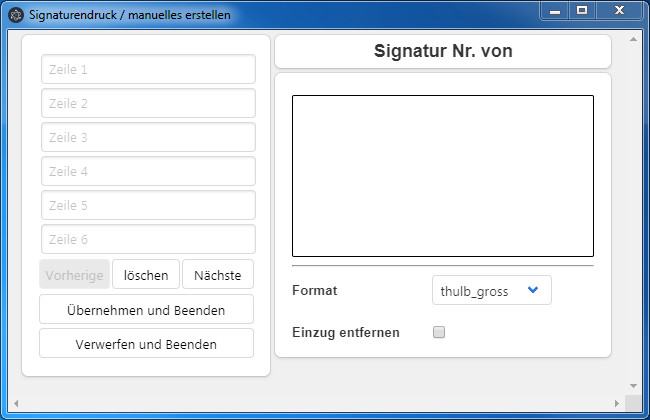
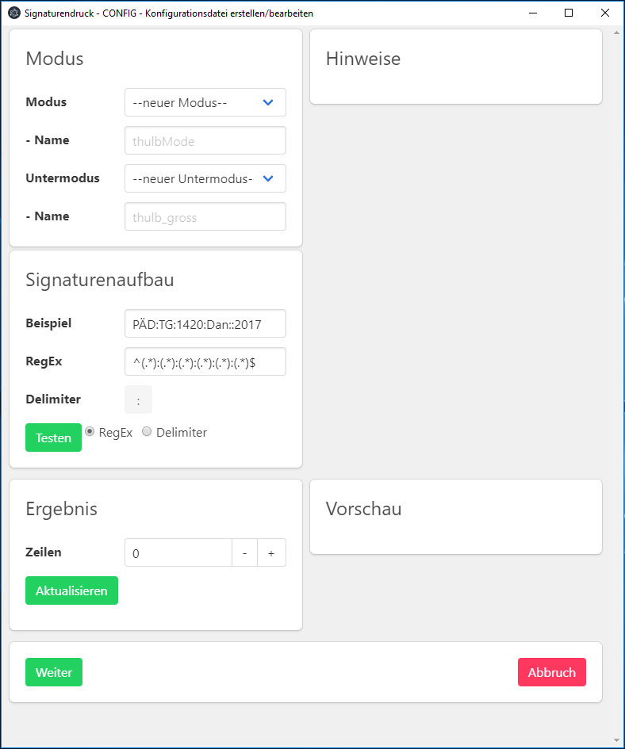
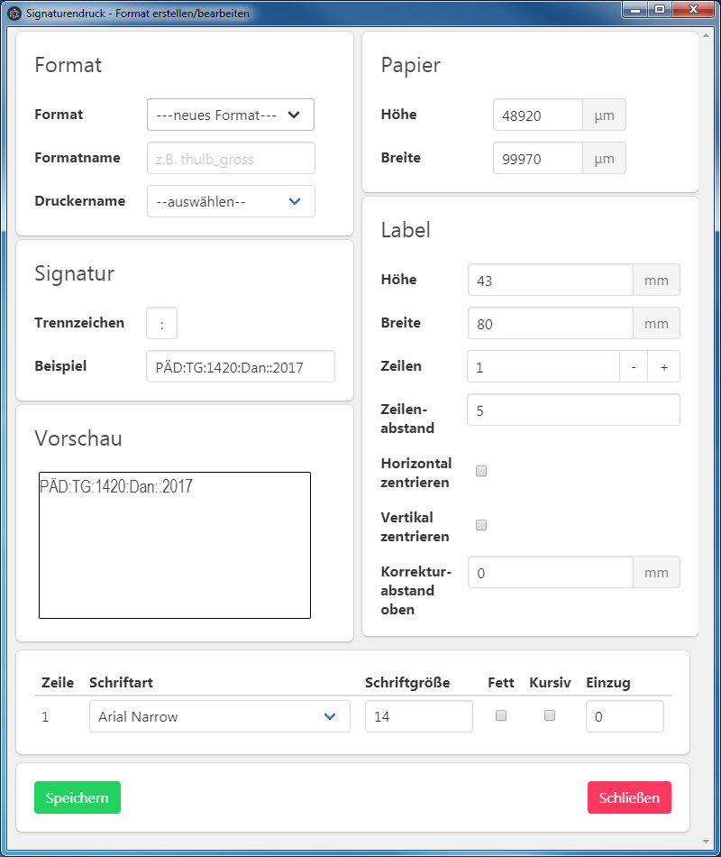

# SignaturenDruck

This is a Electron application to print shelfmarks read from a `.dnl`-file. It displays shelfmarks from the file in a table like structure. You can then select and print the shelfmarks you like.

The printing process creates `.pdf`-files (each per selectet format) and proceeds to print them via powershell and Adobe Acrobat Reader DC.  
The Acrobat Reader gets opened for a short time (~4 seconds) to print the files. It will close by itself, except it was already open.

To use this application you'll need to have the [Adobe Acrobat Reader DC](https://get.adobe.com/reader/) installed and set as default pdf-viewer.

To clone and run this repository you'll need [Git](https://git-scm.com) and [Node.js](https://nodejs.org/en/download/) (which comes with [npm](http://npmjs.com)), [python 2.7](https://www.python.org/downloads/release/python-2714/) and an c/c++ compiler installed on your computer. From your command line:

```bash
# Clone this repository
git clone https://github.com/gbv/SignaturenDruck
# Go into the repository
cd SignaturenDruck/signaturenDruck
# Install dependencies
npm install
# Run the app
npm start
```

The app creates the directory `C:\SignaturenDruck` and stores the config files in it.

In the `config.json` you can change the various switches, like `defaultMode` or `defaultDownloadPath`.

The devMode disables the actual printing. It will show the otherwise hidden label-windows. The pdf-files can be found at: `C:\SignaturenDruck`

**Clone and run for a quick way to see Electron in action.**

To build the app for win7/10 32bit:

```bash
npm run build:exe
```

To build the app for win7/10 64bit:

```bash
npm run build:exe64
```

To build a portable windows .exe:

```bash
npm run build:portable
```

# Dokumentation

## Installation
Das Programm kann einfach mit der entsprechenden `.exe` (ia32 oder x64) installiert werden.  
Das Programm wird dann unter `C:\Users\USERNAME\AppData\Local\Programs\SignaturenDruck_neu` installiert.  
Auf dem Desktop des Nutzers wird eine Verknüpfung zum starten des SignaturenDrucks erzeugt.  
Nach erfolgreicher Installation startet das Programm auch direkt.

## Arbeiten mit dem Programm
### Start des Programms
Es wird bei jedem Start des Programms geprüft ob die notwendigen Konfigurationsdateien und Ordner vorhanden sind, ist dies nicht der Fall so werden diese neu erstellt.  
Hierbei handelt es sich um:  

- `C:\Export\`
- `C:\SignaturenDruck\`
  - `./config.json` - die primäre Konfigurationsdatei (nicht aus der Oberfläche heraus editierbar, nach Veränderungen muss das Programm neugestartet werden).
  - `./Formate\` - enhält die Konfigurationsdateien der eingerichteten Formate.
  - `./FormateCSS\` - enthält die CSS-Dateien der eingerichteten Formate.
  - `./Modi\` - enhält die Konfigurationsdateien der eingerichteten Modi.


Sind diese Ordner/Dateien vorhanden so wird die geprüft ob die Datei die in der `config.json` unter `defaultPath` angegeben ist existiert.  
Ist dies der Fall dann werden die enthaltenen Signaturen ausgelesen und angezeigt.
  
Sollte die angegebene Datei nicht vorhanden sein, so wird eine entsprechende Meldung in der Oberfläche angezeigt.
  

### Andere Datei auswählen

Mit einem Klick auf `Dateiauswahl` kann man eine andere Datei auswählen, aus der dann die Signaturen ausgelesen werden.

### Signaturauswahl

Jede Signatur kann in ihrer Zeile mit einem Klick auf die Checkbox in der Spalte `Drucken` zum Druck ausgewählt werden. Die Auswahl kann einzeln erfolgen oder durch einen Klick auf den Splatenkopf `Drucken`. Dies kehrt die bisher getroffene Auswahl um, sollte also noch keine Signatur zum Druck ausgewählt worden sein, so werden durch alle Signaturen der Tabelle zum Druck ausgewählt.  

In der Spalte `Anzahl` kann festegelegt werden wie oft die jeweilige Signatur gedruckt werden soll. Der Standardwert ist `1`.  

In der Spalte `Format` kann, wie der Name schon sagt, das Format ausgewählt werden mit dem die Signatur gedruckt werden soll. Vom gewählten Format ist abhängig wie die Signatur dargestellt wird, wie groß das Etikett ist und an welchem Drucker gedruckt werden soll.  

Der Druck der ausgewählten Signaturen erfolgt dann mit einem Klick auf die Schaltfläche `Drucken`. Anschließend wird eine Meldung über den erfolgreichen Druck ausgegeben.  
Während des Drucks öffnet und schließt sich der Adobe Reader DC entsprechend der Anzahl der gewählten Formate. Sollten Sie den Adobe Reader DC bereits vor dem Druck geöffnet haben, sowird dieser nicht automatisch geschlossen.

### Manuelles Anlegen

Der SignaturenDruck ermöglicht nicht nur den Druck von Signaturen aus einer Datei oder via SRU, sondern auch das erstellen von manuellen Signaturen. Mit einem Klick auf die Schaltfläche `Manuelles Anlegen` öffnet sich folgendes Fenster zur Eingabe:  


Auf der linken Seite befinden sich die Eingabefelder der jeweiligen Zeilen und die Schaltflächen.  
Rechts befinden sich die Übersicht um welche manuelle Signatur es sich handelt, die Vorschau der Signatur, die Auswahl des Formats und die Option den Einzug zu entfernen.  

Nachdem eine Signatur eingetragen wurde, kann mit der Schaltfläche `Nächste` eine weitere Signatur eingetragen werden. Die Schaltfläche `Übernehmen und Beenden` speichert alle eingegebenen Signaturen ab, fügt sie im Hauptfenster der Tabelle hinzu und kehrt zu diesem Fenster zurück.  

Es besteht aber auch die Möglichkeit alle bisher eingetragenen manuellen Signaturen mit der Schaltfläche `Verwerfen und Beenden` gesammelt zu löschen.  

Das löschen einer einzelnen Signatur ist mit der Schaltfläche `löschen` möglich. Diese löscht immer die aktuell angezeigte Signatur.  

Mit den Schaltflächen `Vorherige` und `Nächste` kann zwischen den bereits eingetragenen Signaturen navigiert werden. Ist man bei der ersten Signatur angelangt so ist die Schaltfläche `Vorherige` deaktiviert.

## Modus erstellen / anpassen

Seit Version v1.1.0-a wird mit Modi/Untermodi der Aufbau der Signaturen festgelegt, wobei jedem Untermodus ein eigenes Format zugeordnet ist, welches den Aufbau des Etiketts festlegt.

Mit der Tastenkombination  
<kbd>strg</kbd> + <kbd>alt</kbd> + <kbd>C</kbd>  
kann das Fenster zum erstellen / bearbeiten eines Modus geöffnet werden.  


### Modus
#### Modus

Im Dropdown kann entweder ein bereits bestehender Modus oder ein "--neuer Modus--" ausgewählt werden.  
Der Name des Modus kann dann Namensfeld eingetragen werden. Wurde ein bereits bestehender Modus gewählt so wird dessen Name in das Feld geladen

#### Untermodus

Im Dropdown werden alle Untermodi des bereits gewählten Modus angezeigt. Analog zum Modus kann ein neuer Untermodus angelegt werden oder der ausgewählte Untermodus bearbeitet werden.
Der Name des Untermodus legt auch den Namen des zugehörigen Formats fest.  

### Signaturenaufbau
#### Beispiel

In diesem Feld wird die Beispielsignatur aus der `config.json` geladen. Die Signatur kann verändert werden.  

#### RegEx

In diesem Feld wird der BeispielregEx aus der `config.json` geladen. Der RegEx dient zum zerlegen der Signatur.  

#### Delimiter

Der Delimiter wird ebenfalls aus der `config.json` geladen. Er dient dazu die Signatur zu zerlegen.  

#### Funktion

Die eingetragene Signatur kann entweder mit dem `RegEx` oder mit dem `Delimiter` zerlegt werden. Dies geschieht nach einem Klick auf `Testen`. Das Resultat wird in der `Vorschau` ersichtlich. Die einzelnen Gruppen werden oben rechts unter `Hinweise` aufgeschlüsselt.  

### Ergebnis

Hier kann die Anzahl der Zeilen und die Anordnung der Signaturenteile angepasst werden. Wurden Anpassungen vorgenommen, so werden diese nach einem Klick auf `Aktualisieren` in der `Vorschau` sichtbar.  
Die Signaturenteile werden mit Platzhaltern dargestellt. So entspricht der Signaturenteil 5 dem Platzhalter `$5`. Alle Platzhalter und ihr aktueller Inhalt sind unter `Hinweise` aufgeschlüsselt.  
Es ist auch möglich, einen festen Text einzutragen der dann immer mit diesem Format, in der entsprechenden Zeile, Anwendung findet.  

Sobald Sie mit der Anordnung der Signaturenteile zufrieden sind und auf `Weiter` geklickt haben, öffnet sich das Formatfenster. Dort können Sie die Gestaltung des Etiketts vornehmen.

Nach dem erfolgreichen Anlegen muss das Programm neu gestartet werden. Soll ein anderer Modus verwendet werden, so muss in der `config.json` der `defaultMode` geändert werden.

## Format anpassen

Mit der Tastenkombination  
<kbd>strg</kbd> + <kbd>alt</kbd> + <kbd>E</kbd>  
kann das Fenster zum anpassen von Formaten geöffnet werden.  



### Format

Mit der Auswahl `Format` ist es möglich die Einstellungen eines bereits erstellen Formats in die Oberfläche zu laden.  

Im Feld `Formatname` wird der Formatname angezeigt, dieser ist nicht editierbar. Beim speichern wird ein Dialog angezeigt, der das anpassen bzw. ein abbrechen ermöglicht.  

Mit der Auswahl `Druckername` kann der Drucker ausgewählt werden, an dem Signaturen mit dem Format gedruckt werden sollen. Es sind nur Drucker aufgeführt die gerade auf dem jeweiligen Rechner installiert sind bzw. zur Verfügung stehen.  

### Signatur

Im Feld `Beispiel` wird die Signatur angezeigt die beim anlegen dieses Formates bzw. beim anlegen des Untermodus festgelegt wurde. Der Feldinhalt kann nicht verändert werden.

### Papier

Es müssen die Maße des verwendeten Papiers angegeben werden, damit das erstellte PDF passgenau erstellt werden kann. Somit können Unschärfen und ähnliche Effekte die durch Skalierung entstehen verhindert werden.  
*Das Label (Etikett) wird auf dem Papier zentriert*  

| Eigenschaft | Beschreibung |  
| :----------: | ------------ |  
| `Höhe` | die Höhe des Papiers in μm |  
| `Breite` | die Breite des Papiers in μm |  

### Label (Etikett)

Es werden unterschiedliche Eigenschaften des Labels erfasst.

| Eigenschaft | Beschreibung |  
| :----------: | ------------ |  
| `Höhe` | ist die Höhe des Labels in mm |  
| `Breite` | ist die Breite des Labels in mm |  
| `Zeilen` | erfasst die Anzahl der Zeilen des Labels |  
| `Zeilenstand` | erfasst den Abstand zwischen den Zeilen des Labels |  
| `Horizontal zentrieren` | ermöglicht das horizontale zentrieren aller Zeilen |  
| `Vertikal zentrieren` | ermöglicht das vertikale zentrieren aller Zeilen |  
| `Korrekturabstand oben` | ermöglicht eine Veränderung des Abstands beim Drucken von der jeweils ersten Zeile eines Labels zum Rand. Positive Werte vergrößern den Abstand, negative Werte verringern den Abstand. |  


### Tabelle

In der Tabelle werden für jede Zeile einige Einstellungsmöglichkeiten angezeigt.  

| Spalte | Beschreibung |
| :----: | ------------ |
| `Zeile` | gibt die Nummder der jeweiligen Zeile des Labels an |  
| `Schriftart` | enthält eine Auswahlmöglichkeit der Schrift welche für die betreffende Zeile verwendet werden soll. Es stehen alle auf dem Rechner installierten Schriften zur Verfügung. |  
| `Schriftgröße` | hier kann die Schriftgröße der jeweiligen Zeile eingetragen werden |  
| `Fett` | mit einem Klick auf die jeweilige Checkbox kann die Zeile als **fett** dargestellt werden |  
| `Kursiv` | mit einem Klick auf die jeweilige Checkbox kann die Zeile als _kursiv_ dargestellt werden |  
| `Einzug` | hier kann der Einzug der jeweiligen Zeile in Prozent eingetragen werden |  

  
### Speichern / Schließen

Mit einem Klick auf `Speichern` kann das Format abgespeichert bzw. können die Änderungen übernommen werden.  

Mit einem Klick auf `Schließen` wird das Fenster geschlossen. Wurde das Format davor nicht abgespeichert so werden die Veränderungen verworfen.  

## Konfig-Optionen

Die `config.json` unter `C:\SignaturenDruck\` bietet folgende Optionen.  

| key | Beschreibung | Standardwert |
| :---: | --- | ---|
| `defaultPath` | damit kann der Pfad zur Datei verändert werden, welche beim starten des Programms automatisch ausgelesen werden soll. | `"C:/Export/download.dnl"` |  
| `sortByPPN` | ermöglicht die ausgelesenen Daten per PPN sortiert darzustellen. | `false` |  
| `useK10plus` | ermöglicht die Verwendung des Datenformates der WinIBW mit K10plus | `true` |  
| `example.shelfmark` | legt eine Signatur fest, die beim anlegen eines neuen Modus/Untermodus angezeigt wird | `"PÄD:TG:1420:Dan::2017"` |  
| `example.location` | legt einen Standort fest, der als Beispielstandort beim anlegen eines neuen Modus/Untermodus angezeigt wird | `"MAG"` |  
| `example.regex` | legt einen regulären Ausdruck fest, der beim anlegen eines neuen Modus/Untermodus angezeigt wird | `"^(.*):(.*):(.*):(.*):(.*):(.*)$"` |  
| `example.delimiter` | legt einen Delimiter fest, der beim anlegen eines neuen Modus/Untermodus angezeigt wird |  
| `modal.showModal` | legt fest ob die Nachricht der erfolgreichen Drucks angezeigt werden soll | `true` |  
| `modal.modalTxt` | bietet die Möglichkeit den Text der Druckerfolgsmeldung anzupassen. | `"Die ausgewählten Signaturen wurden gedruckt."` |  
| `SRU.useSRU` | ermöglicht die Daten per SRU zu laden | `false` |  
| `SRU.SRUAddress` | enthält die URL des SRU-Servers über den die Daten geladen werden, sofern `useSRU: true` | `"http://sru.k10plus.de/opac-de-27"` |  
| `SRU.QueryPart1` | der erste Teil des SRU-Query | `"?version=1.1&operation=searchRetrieve&query=pica.bar="` |  
| `SRU.QueryPart2` | der zweite Teil des SRU-Query | `"&maximumRecords=1&recordSchema=picaxml"` |  
| `print.printImmediately` | ermöglicht den Sofortdruck, aktuell ohne Funktion | `false` |  
| `print.printCoverLabel` | ermöglicht den Druck des CoverLabels (Username + Datum) | `true` |  
| `mode.defaultMode` | legt den zu verwendenden Modus fest | `"thulbMode"` |  
| `devMode` | dient zur Fehlersuche, zeigt die Fenster der jeweiligen Formate an, die im Formalfall nicht zu sehen sind. Die PDFs werden erstellt aber weder gelöscht noch gedruckt. | `false` |  

## FAQ

### Modus / Untermodus

#### Ich sehe das Format, kann es aber nie auswählen.

Dies kann zwei Ursachen haben.  
1. Ursache: Das Format gehört zu einem Untermodus der nicht dem derzeitigen Modus zugeordnet ist.  
Lösung: Tragen Sie in der `config.json` den Modus zu dem der Untermodus gehört als `defaultMode` ein und starten das Programm neu.  

2. Ursache: Die Signaturen entsprechen nicht der im Untermodus festgelegten Aufteilung.  
Erklärung: Beim auslesen der Signaturen aus einer Datei oder via SRU wird geprüft welche Untermodi/Formate diese Signatur entsprechend Festlegung darstellen können.  
Lösung: Wenn eine Signatur eigentlich einem Format entsprechen sollte, aber dieses nicht auswählbar ist, so sollten Sie den Untermodus kontrollieren.  
Mit <kbd>strg</kbd> + <kbd>alt</kbd> + <kbd>C</kbd> öffen Sie die "Modus erstellen / anpassen"-Oberfläche. Nun wählen Sie den Modus und endsprechenden Untermodus aus und können die Konfiguration prüfen.

### Sonstige

#### Warum benötige ich den Adobe Acrobat Reader DC als Standard PDF-Programm?

Der Adobe Acrobat Reader DC wird für den Druck benötigt. Ist dieser nicht das Standard PDF-Programm so schlägt der Druck fehl.

## License

[CC0 1.0 (Public Domain)](LICENSE.md)
